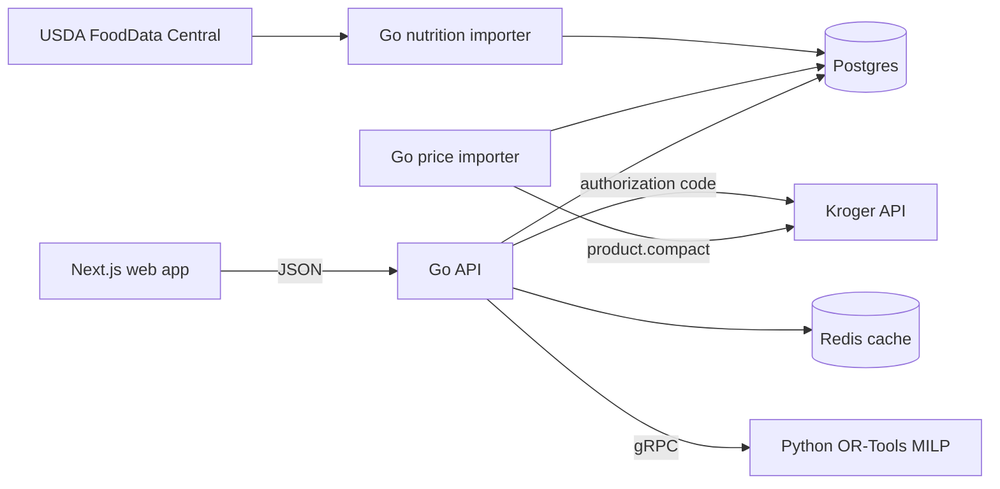

# Macro-Max

Macro-Max finds the least-cost weekly grocery basket that meets a person's macro targets. It solves a mixed-integer program over whole packages and current prices from one supported catalog:

**Harris Teeter · University Place**

2110 S. Estes Drive, Chapel Hill, NC · Kroger location `09700117`

The model enforces protein, carbohydrate, and fat targets; an optional calorie ceiling; a weekly budget; dietary tags; category coverage; and food variety. Results include the basket cost, achieved macros, and cost per gram of protein.

## Architecture



The optimizer, rather than a language model, determines the basket and proves optimality. Optional Claude recipe generation only turns an already-solved basket into meal suggestions.

## Run locally

Requirements: Go, Docker, `golang-migrate`, Node.js, npm, and Kroger developer credentials.

```bash
cp .env.example .env
```

Set `KROGER_CLIENT_ID` and `KROGER_CLIENT_SECRET`, then start the infrastructure and load the schema:

```bash
make up
make migrate-up
make seed
make kroger-dry
make kroger-ingest
```

Run the API and frontend in separate terminals:

```bash
make run
```

```bash
make web
```

Open <http://localhost:3000>. The UI always solves against the University Place catalog; there is no store picker or synthetic product catalog.

`WEB_APP_URL` is required by the API server whenever it registers the Kroger cart routes, and it has no localhost fallback — a production OAuth flow cannot silently redirect to a developer machine. Command-line tools that use Kroger credentials without serving a callback, such as `make kroger-ingest`, do not need it.

## Kroger cart flow

Register this exact local callback in the Kroger developer portal:

```text
http://localhost:3000/api/kroger/callback
```

Set `NEXT_PUBLIC_KROGER_CART=true` for a local cart demo. After solving, **Add to my Kroger cart** sends the browser to Kroger. The user signs in and grants `cart.basic:write`; the callback fills that account's cart and returns to Macro-Max. OAuth tokens are used only during that callback request and are never stored. Users authorize each cart fill.

Cart writes are additive. Test with a small basket and do not submit the same basket repeatedly.

## Optional integrations

- `FDC_API_KEY` enables USDA nutrition enrichment with `make fdc-dry` and `make fdc-import`.
- `ANTHROPIC_API_KEY` enables the backend recipe route only when
  `RECIPE_ACCESS_KEY` is also set. Trusted server-side callers must send the
  latter in `X-Recipe-Key`; never put it in a `NEXT_PUBLIC_*` variable. Recipe
  generation is not exposed by the browser application.
- `TRUSTED_PROXY_CIDRS` is an optional comma-separated list of reverse-proxy
  networks whose `X-Forwarded-For` headers the API may trust. It defaults to
  trusting none; configure only CIDRs supplied by your hosting provider.

The API rate limiter is process-local. It is effective for this project's
single-instance deployment, but a multi-instance deployment needs a shared
gateway or datastore-backed limiter to enforce a combined quota.

## API

| Method | Route | Purpose |
|---|---|---|
| `GET` | `/v1/healthcheck` | Database-backed health check |
| `GET` | `/v1/foods` | Nutrition catalog |
| `GET` | `/v1/products` | University Place product catalog |
| `POST` | `/v1/targets` | Save nutrition and budget targets |
| `GET` | `/v1/targets/{id}` | Read a target |
| `POST` | `/v1/solve` | Optimize a target |
| `POST` | `/v1/kroger/authorize` | Start a cart authorization for a solved target |
| `GET` | `/v1/kroger/callback` | Fill the authorized cart and return to the web app |
| `POST` | `/v1/recipes` | Generate optional meal suggestions |

Clients do not choose a `store_id`; the API assigns `09700117`.

## Checks

```bash
make lint
make test
make test-int
make solver-test
make web-build
cd web && npm run test:e2e
```

To rebuild local data from scratch:

```bash
make down-v
make up
make migrate-up
make seed
make kroger-ingest
```

## Deployment

The no-billing deployment uses Vercel Hobby for the frontend, one Render Free
container for the Go API and Python solver, and Neon Free for PostgreSQL. See
[docs/DEPLOY.md](docs/DEPLOY.md) for the dashboard setup, environment variables,
and production checks.

Price refreshes run from `.github/workflows/kroger-ingest.yml` directly against
Neon for the fixed University Place location. The importer records price
history only when a price changes and marks products unavailable when they
disappear from the catalog.
